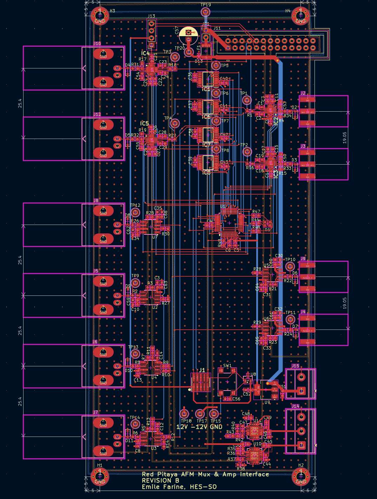

# Open-Source Zynq-Based AFM Acquisition System

An open, low-cost acquisition instrument for Atomic Force Microscopy (AFM), built around the
[Red Pitaya STEMlab 125-14](https://redpitaya.com/) (Xilinx Zynq-7010 SoC) and delivered as a
self-contained 19-inch rack unit. It replaces the closed, expensive and proprietary acquisition
boards typically used in AFM setups with a fully inspectable and extensible signal chain.

The instrument generates an excitation signal, conditions it through a custom analog board,
drives the AFM, acquires the cantilever response, and processes it (FFT, peak detection,
lock-in detection) entirely on the device. Results are exposed over the network through an
SCPI-inspired protocol and can be driven from Python, LabVIEW, MATLAB or any TCP client.



## Architecture

The system is organised in four layers:

| Layer | Description | Location |
|-------|-------------|----------|
| **FPGA datapath** | Custom programmable-logic design on the Zynq: excitation generation and acquisition around a single shared BRAM, with adaptive decimation | [`fpga/`](fpga/) |
| **Analog board** | Custom conditioning board: programmable gain (×1/8 to ×16), input multiplexer, ±10 V range, analog sum/difference outputs, LPC1114 control microcontroller, OLED IP display | [`hardware/`](hardware/), [`ElectronicBoard/`](ElectronicBoard/) |
| **Embedded C++ server** | Single-client TCP server running on the Red Pitaya's Linux, exposing an SCPI-inspired command language over the network | [`cpp/`](cpp/) |
| **Python clients** | Client library, interactive CLI, PyQt6 desktop GUI, deployment tooling and plotting scripts | [`python/`](python/) |

Two measurement modes are available: a **broadband sinc** that captures a whole spectrum in a
few milliseconds, and a **lock-in sweep** that resolves narrow resonances.

### Repository layout

```
cpp/                 Embedded C++ server + signal processing (build & run on the Red Pitaya)
  Hardware/          Hardware abstraction: FPGA register access, board UART, SSD1306 OLED
  Server/            TCP server, SCPI command handler, protocol
  SignalProcessing/  Signal generation, FFT (FFTW3), resonance/calibration analysis
  Test/              Standalone hardware and DSP validation programs
  Tools/             oled-ip helper + systemd service
python/              Client library, CLI, GUI and deployment
fpga/
  rtl/               SystemVerilog / VHDL sources for the custom datapath
  bitfiles/          Prebuilt bitstream (flash without rebuilding in Vivado)
ElectronicBoard/
  src/               LPC1114 firmware for the analog board (MUX + gain control)
hardware/
  TM_MUX_Board_REV_B/  KiCad 10 project: schematics, PCB, 3D model, interactive BOM
```

## Requirements

### Hardware
- Red Pitaya STEMlab 125-14 (Zynq-7010)
- Custom analog MUX board (design in [`hardware/`](hardware/))
- For the DAC->ADC loopback tests: a cable from OUT1 to IN1

### Software
- **Client PC:** Python **3.10+** (developed on 3.13)
- **On the Red Pitaya:** `g++` (C++17), FFTW3 single precision (`libfftw3f`), Red Pitaya
  libraries (`librp`, `librp-hw`, `librp-hw-calib`, `librp-hw-profiles`), all present on
  the stock Red Pitaya OS 2.0+ image
- **FPGA rebuilds only:** Xilinx Vivado/Vitis (a prebuilt bitstream is shipped, so this is
  optional)
- **Board firmware only:** MCUXpresso IDE + a J-Link EDU mini

## Installation

```bash
git clone https://github.com/emilefarine/redpitaya-afm 
cd redpitaya-afm
python -m venv .venv
# Windows:  .venv\Scripts\activate.bat
# Linux/macOS:  source .venv/bin/activate
pip install -r python/requirements.txt
```

All scripts that connect to the board accept `--host <ip>` (or the `RP_HOST` environment
variable). SSH credentials default to the Red Pitaya factory login `root` / `root` and can be
overridden with `--user` / `--password` (or `RP_USER` / `RP_PASSWORD`).

## Usage

### 1. Flash the FPGA bitstream

A prebuilt bitstream is included, so you do not need Vivado:

```bash
python python/rp_deploy.py --host 192.168.1.100 --deploy
python python/rp_deploy.py --host 192.168.1.100 --status   # expect: FPGA state operating
```

By default the newest `fpga/bitfiles/*.bit.bin` is used; pass `--bitfile <path>` to select
another. A raw `.bit` (from a local Vivado build) is converted automatically with `bootgen`
(point to it with `--bootgen` / the `BOOTGEN` env var, or let the script scan a local Vitis
install).

### 2. Build and deploy the C++ server

The C++ code is compiled **on the Red Pitaya** (not cross-compiled). `rp_deploy.py` mirrors
the sources over SSH, then build with `make`:

```bash
python python/rp_deploy.py --host 192.168.1.100 --cpp      # sync sources to the board

# then over SSH on the Red Pitaya, from the synced cpp/ directory:
make server        # build the AFM SCPI server
./afm_server       # run it (listens on TCP 5025)
```

Other `make` targets: `make all` (production programs), `make tests` (hardware/DSP test
programs), `make tools`. See the individual `Test/` programs for loopback and validation.

### 3. Connect a client

Interactive CLI:

```bash
python python/afm_cli.py 192.168.1.100
```

Desktop GUI (PyQt6, real-time magnitude/phase plots):

```bash
python python/afm_gui.py
```

Python library:

```python
from afm_client import AFMClient

with AFMClient("192.168.1.100") as client:
    client.init()
    spectrum = client.measure_sinc(center_kHz=1000, bandwidth_kHz=200)
    peak = spectrum.freq_kHz[spectrum.magnitude.argmax()]
    print(f"Peak at {peak:.1f} kHz")

    sweep = client.measure_sweep(center_kHz=1000, range_kHz=100, step_kHz=0.5)
```

## SCPI protocol

The server speaks an SCPI-inspired ASCII protocol over **TCP port 5025**. Commands are
case-insensitive, colon-separated, `?`-suffixed for queries, with comma-separated arguments;
every line ends with `\n`. Responses are a single line: `OK [data]` or `ERR_<CODE>: <message>`.

| Command | Description |
|---------|-------------|
| `*IDN?` / `*RST` / `*OPC?` | IEEE 488.2 common commands |
| `SYSTEM:INIT` / `SYSTEM:DEINIT` / `SYSTEM:STATUS?` | Hardware lifecycle and status |
| `BOARD:MUX:ROUTE <out>,<in>` | Route input to output (channels 1-4) |
| `BOARD:GAIN <ch>,<idx>` | Set programmable gain (idx 0-7 → ×1/8 … ×16) |
| `MEASURE:SINC <center_kHz>,<bw_kHz>[,<samples>,<dec>,<amp>]` | Broadband sinc + FFT |
| `MEASURE:SWEEP <center_kHz>,<range_kHz>[,<step_kHz>,<dec>,<amp>]` | Lock-in frequency sweep |

`MEASURE:*` return a multi-line spectrum: a header `OK DATA <N> <BYTES>` followed by `N` rows of
`freq_kHz,magnitude,phase_rad`. `<BYTES>` is the exact size of the payload that follows the
header line, so a client can read it in one shot instead of scanning for newlines.

## MUX board firmware

The analog board is controlled by an on-board **LPC1114** microcontroller (MUX routing,
programmable gain, OLED IP display). Firmware sources are in [`ElectronicBoard/src/`](ElectronicBoard/src/).

To build and flash with **MCUXpresso IDE**:

1. Create a new C++ project for the LPC1114/LPC1125 target (the sources include the
   `cr_startup_lpc11xx` startup and `crp.c` code-read-protection files).
2. Import the contents of `ElectronicBoard/src/` into the project's source folder.
3. Build, then flash to the board over SWD using a **J-Link** debug probe (Debug / Program).

## Hardware design

The analog MUX board (REV B) is designed in **KiCad 10**, under
[`hardware/TM_MUX_Board_REV_B/`](hardware/TM_MUX_Board_REV_B/):

- Schematics: open `TM_MUX_Board_REV_B.kicad_pro`, or read the exported PDFs
- PCB layout: `TM_MUX_Board_REV_B.kicad_pcb`
- 3D model: `TM_MUX_Board_REV_B.step`
- Interactive BOM: `bom/ibom.html` (open in a browser)

## License

Released under the [MIT License](LICENSE).

Developed as a Master's thesis, *"Design and Implementation of an Open-Source Zynq-Based
Synchronous Acquisition System for Atomic Force Microscopy"*, by Emile Farine at the HES-SO
Master of Science in Engineering (hepia / MSE), in collaboration with the DQMP, University of
Geneva.
